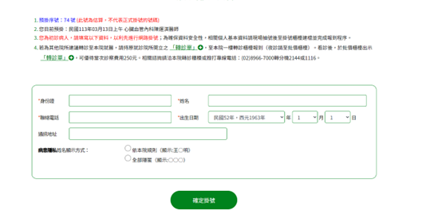

# 第1次作業-作業-HW1
>
>學號：111111209
> 
>姓名：施柏賢
> 
>作業撰寫時間：100 (mins，包含程式撰寫時間)
> 
>最後撰寫文件日期：2024/03/11
>

本份文件包含以下主題：(至少需下面兩項，若是有多者可以自行新增)
- [x] 說明內容
- [x] 個人認為完成作業須具備觀念

## 說明程式與內容

1.
git check c31ee496a6dd2209c4c6824732c532edf3a30e01 (This is a bear)  接著，使用指令 git branch dev 產生一個名為 "dev" 的分支 ，切換到 "dev" 分支，指令為 git checkout dev，修改 "dev" 分支下的 A.txt，手動逐字新增「This is an apple.」到 A.txt 的內容之下，
切換回 "main" 分支，指令為 git checkout main， 接著合併git merge dev 將會產生衝突，再進行兩者來源接受即可，最後git add A.txt git commit git push

2.
選擇日期和醫師

填寫個人資料

掛號完成

